      

# Vi-Transformers for Physical Field Prediction
## Anthony Kalaydjian  
<!-- [Safran Tech](https://www.safran-group.com/fr/groupe/innovation/safran-tech) - [EPFL](https://www.epfl.ch/fr/) -->

    
    <!--  -->

    4 July 2025

---

## Physics Regression Problem
### Problem statement

---

## Physics Regression Problem
### Problem statement

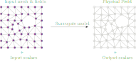

---

## Physics Regression Problem
### GNNs

<!-- **Message passing**

$$
\mathbf{x}_i^{(k)} = \gamma^{(k)} \left( \mathbf{x}_i^{(k-1)}, \bigoplus_{j \in \mathcal{N}(i)} \, \phi^{(k)}\left(\mathbf{x}_i^{(k-1)}, \mathbf{x}_j^{(k-1)},\mathbf{e}_{j,i}\right) \right)
$$

 -->

#### **GCN**

$$
\mathbf{x}_i^{(k)} = \sum_{j \in \mathcal{N}(i) \cup \{ i \}} \frac{1}{\sqrt{\deg(i)} \cdot \sqrt{\deg(j)}} \cdot \left( \mathbf{W}^{\top} \cdot \mathbf{x}_j^{(k-1)} \right) + \mathbf{b},
$$

---

## Physics Regression Problem
### Receptive field

<table style="margin: auto; text-align: center;">
  <tr>
    <td style="text-align: center; vertical-align: middle;">
      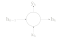
    </td>
    <td style="text-align: center; vertical-align: middle;">
      
    </td>
    <td style="text-align: center; vertical-align: middle;">
      
    </td>
  </tr>
  <tr>
    <td><b>RNN</b></td>
    <td><b>CNN</b></td>
    <td><b>GNN</b></td>
  </tr>
</table>

---

## Method
### Transformers

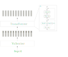

---

## Method
### Attention

$$
\text{Attention}(Q, K, V) = \text{SoftMax}\left(\dfrac{QK^T}{\sqrt{l}} \right) V
$$

$$
Q \in \mathbb{R}^{m \times l}\newline
K, V \in \mathbb{R}^{n \times l}
$$

**Self-attention:**
$$
\begin{cases}
\begin{align*}
Q &= X W_Q & W_Q \in \mathbb{R}^{d \times l} \newline
K &= X W_K & W_K \in \mathbb{R}^{d \times l} \newline
V &= X W_V & W_L \in \mathbb{R}^{d \times l}
\end{align*}
\end{cases}
$$

$$
X \in \mathbb{R}^{n \times d}
$$

---

## Method
### Transformers in NLP

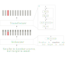

---

## Method
### Transformers in NLP

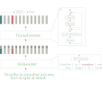

---

## Method
### Transformers in CV

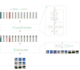

---

## Method
### Transformers in Physics Regression

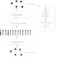

---

## Method
### Mesh Vision Transformer

---

## Experiments
### Questions

1. Order of nodes within each patch?
2. Patch consistency across samples? (relative position of patches)
3. Positional encoding?
4. Shape of patches?

---

## Experiments
### Order of nodes within each patch? ❌
#### Morton ordering

---

## Experiments
### Patch regularity?
#### Mesh $\rightarrow$ Image

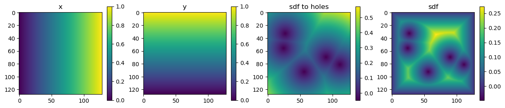

  Powerful Mesh processing with Muscat

---

## Experiments
### Patch regularity? ✅
#### ViT with 2D patch PE

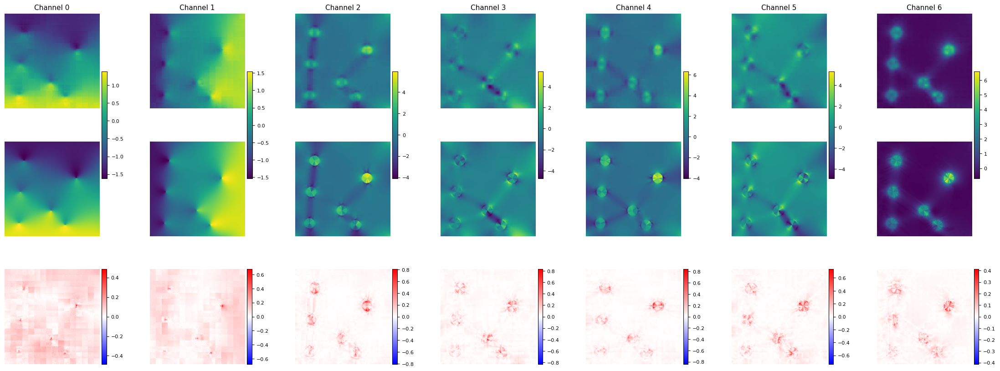

ViT with PE

---

## Experiments
### Positional encoding? ❌
#### ViT without 2D patch PE

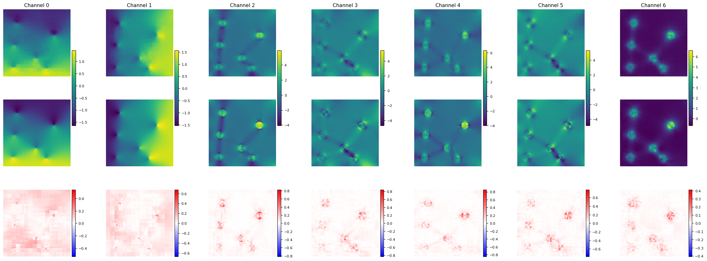

ViT without PE

---

## Experiments
### Patch consistencity across samples?
#### MMVT (Mesh Morphing Vision Transformer)

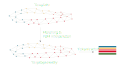

---

## Experiments
### Patch consistencity across samples?
#### MMVT (Mesh Morphing Vision Transformer)

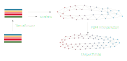

---

## Results
### PLAID Benchmark -- Evaluation Metrics

$$
\begin{align*}
\mathrm{RRMSE}_f(\mathbf{f}_{\rm ref}, \mathbf{f}_{\rm pred}) &= \left( \frac{1}{n_\star}\sum_{i=1}^{n_\star} \frac{\frac{1}{N^i}\|\mathbf{f}^i_{\rm ref} - \mathbf{f}^i_{\rm pred}\|_2^2}{\|\mathbf{f}^i_{\rm ref}\|_\infty^2} \right)^{1/2}\\
\mathrm{RRMSE}_s(\mathbf{s}_{\rm ref}, \mathbf{s}_{\rm pred}) &= \left( \frac{1}{n_\star} \sum_{i=1}^{n_\star} \frac{|\mathbf{s}^i_{\rm ref} - \mathbf{s}_{\rm pred}^i|^2}{|\mathbf{s}^i_{\rm ref}|^2} \right)^{1/2}
\end{align*}
$$
$$
\text{score} = \dfrac{1}{\left( N_f + N_s \right)} \left[ \sum_{f} \mathrm{RRMSE}_{f}(\mathbf{f}_{\rm ref}, \mathbf{f}_{\rm pred}) + \sum_{s} \mathrm{RRMSE}_{s}(\mathbf{s}_{\rm ref}, \mathbf{s}_{\rm pred}) \right]
$$

---

---

        
Thank you for your **attention** !