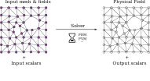

      

# Vi-Transformers for Physical Field Prediction
## Anthony Kalaydjian  
<!-- [Safran Tech](https://www.safran-group.com/fr/groupe/innovation/safran-tech) - [EPFL](https://www.epfl.ch/fr/) -->

    
    

    20 June 2025

---

## Physics Mesh Regression Problem

---

## Vi-Transformers

Morphing?

---

### Morphing?

---

## Regular Images grid

  Powerful Mesh processing with Muscat

---

## Unet 1/2

---

## Unet 2/2

Unet

---

## ViT with 2D patch PE

ViT with PE

---

## ViT without 2D patch PE

ViT without PE

---

## Pre-training MAE ViT 1/2

He et al., Masked Autoencoders Are Scalable Vision Learners, <a href="https://arxiv.org/abs/2111.06377" target="_blank">arXiv:2111.06377</a>

---

## Pre-training MAE ViT 2/2

Target

Reconstruction

---

##  Encoding

---

##  Decoding

---

        
Thank you for your **attention** !

---

## References

He, K., Chen, X., Xie, S., Li, Y., Dollár, P., & Girshick, R. (2021).  
**Masked Autoencoders Are Scalable Vision Learners**.  
arXiv: [2111.06377](https://arxiv.org/abs/2111.06377)