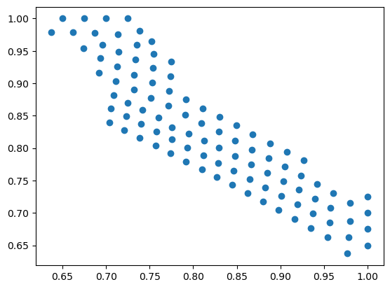
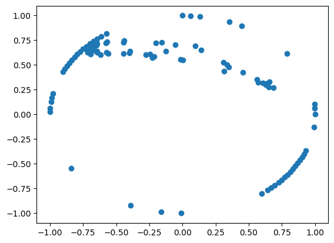
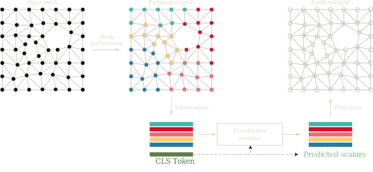
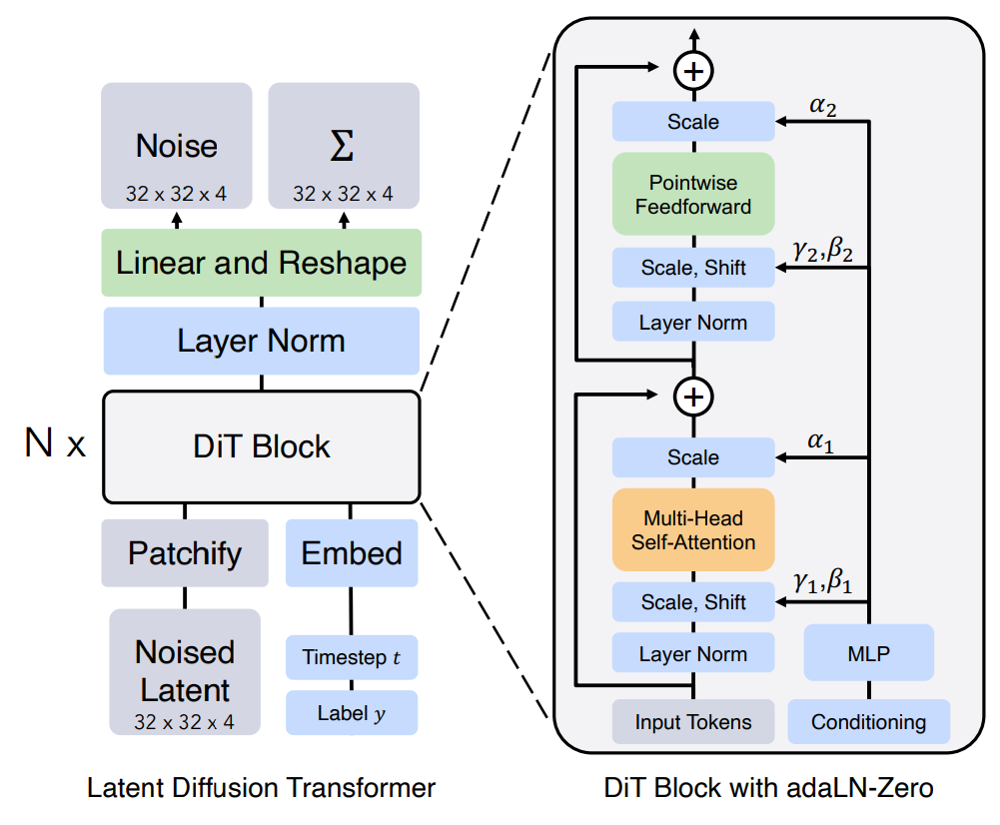

      

# Vi-Transformers for Physical Field Prediction
## Anthony Kalaydjian  
<!-- [Safran Tech](https://www.safran-group.com/fr/groupe/innovation/safran-tech) - [EPFL](https://www.epfl.ch/fr/) -->

    
    

    23 May 2025

---

## Physics Mesh Regression Problem

---

## PLAID Benchmark 2/5 -- Evaluation Metrics

``
$$
\begin{align*}
\mathrm{RRMSE}_f(\mathbf{f}_{\rm ref}, \mathbf{f}_{\rm pred}) &= \left( \frac{1}{n_\star}\sum_{i=1}^{n_\star} \frac{\frac{1}{N^i}\|\mathbf{f}^i_{\rm ref} - \mathbf{f}^i_{\rm pred}\|_2^2}{\|\mathbf{f}^i_{\rm ref}\|_\infty^2} \right)^{1/2}\\
\mathrm{RRMSE}_s(\mathbf{s}_{\rm ref}, \mathbf{s}_{\rm pred}) &= \left( \frac{1}{n_\star} \sum_{i=1}^{n_\star} \frac{|\mathbf{s}^i_{\rm ref} - \mathbf{s}_{\rm pred}^i|^2}{|\mathbf{s}^i_{\rm ref}|^2} \right)^{1/2}
\end{align*}
$$
$$
\text{score} = \dfrac{1}{\left( N_f + N_s \right)} \left[ \sum_{f} \mathrm{RRMSE}_{f}(\mathbf{f}_{\rm ref}, \mathbf{f}_{\rm pred}) + \sum_{s} \mathrm{RRMSE}_{s}(\mathbf{s}_{\rm ref}, \mathbf{s}_{\rm pred}) \right]
$$
``

<!--  -->

---

## Vi-Transformers

---

### Tokenization 1/2: Padding + Morton registration

    
    <!--  -->
    

---

### Tokenization 2/2: 3d patches

    <iframe src="assets/morton/rotor_patch_0.html" style="width: 1200px; height: 400px; border: none; font-size: 0.01em;"></iframe>
    <iframe src="assets/morton/rotor_patch_1.html" style="width: 1200px; height: 400px; border: none; font-size: 0.01em;"></iframe>

---

## PLAID Article

---

## First Benchmark Results

- Performance equivalent to MGN
- Train time reduced significantly

  

Other methods:

- MARIO (Neural Fields Representation): Geometry encoding using the SDF
- MMGP: Morphing to a common geometry

---

## Next step

- **Switch on A100 cluster**

  

### Technical tasks:
* Fix the training environment

  

### Scientific tasks:
* Morphing
* Decoder
* Conditioning through network modulation

---

### Morphing

---

### Decoder

---

### Conditioning by layer modulation

---

        
Thank you for your **attention** !