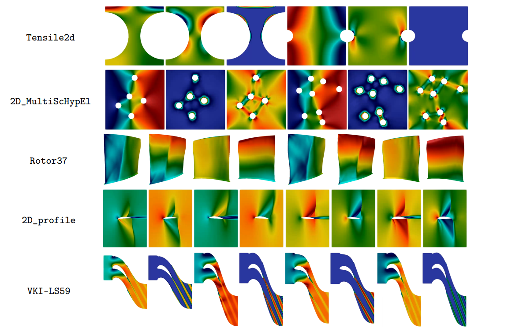

      

# Vi-Transformers for Physical Field Prediction
## Anthony Kalaydjian  
<!-- [Safran Tech](https://www.safran-group.com/fr/groupe/innovation/safran-tech) - [EPFL](https://www.epfl.ch/fr/) -->

    
    

    23 May 2025

---

## Physics Mesh Regression Problem

---

## PLAID Benchmark 2/5 -- Evaluation Metrics

``
$$
\begin{align*}
\mathrm{RRMSE}_f(\mathbf{f}_{\rm ref}, \mathbf{f}_{\rm pred}) &= \left( \frac{1}{n_\star}\sum_{i=1}^{n_\star} \frac{\frac{1}{N^i}\|\mathbf{f}^i_{\rm ref} - \mathbf{f}^i_{\rm pred}\|_2^2}{\|\mathbf{f}^i_{\rm ref}\|_\infty^2} \right)^{1/2}\\
\mathrm{RRMSE}_s(\mathbf{s}_{\rm ref}, \mathbf{s}_{\rm pred}) &= \left( \frac{1}{n_\star} \sum_{i=1}^{n_\star} \frac{|\mathbf{s}^i_{\rm ref} - \mathbf{s}_{\rm pred}^i|^2}{|\mathbf{s}^i_{\rm ref}|^2} \right)^{1/2}
\end{align*}
$$
$$
\text{score} = \dfrac{1}{\left( N_f + N_s \right)} \left[ \sum_{f} \mathrm{RRMSE}_{f}(\mathbf{f}_{\rm ref}, \mathbf{f}_{\rm pred}) + \sum_{s} \mathrm{RRMSE}_{s}(\mathbf{s}_{\rm ref}, \mathbf{s}_{\rm pred}) \right]
$$
``

<!--  -->

---

## Vi-Transformers

---

### Tokenization 1/2: Padding + Morton registration

    
    <!--  -->
    

---

### Tokenization 2/2: 3d patches

    <iframe src="assets/morton/rotor_patch_0.html" style="width: 1200px; height: 400px; border: none; font-size: 0.01em;"></iframe>
    <iframe src="assets/morton/rotor_patch_1.html" style="width: 1200px; height: 400px; border: none; font-size: 0.01em;"></iframe>

---

## PLAID Article

---

## First Benchmark Results

  <table border="1">
    <thead>
      <tr>
        <th colspan="8" style="text-align:center; font-size: 1.2em;">2D_profile</th>
      </tr>
      <tr>
        <th>Field</th>
        <th>MGN</th>
        <th>MMGP</th>
        <th>Vi-Transf.</th>
      </tr>
    </thead>
    <tbody>
      <tr><td><strong>Mach</strong></td><td><u>0.0604</u></td><td><strong>0.0514</strong></td><td>0.0699</td></tr>
      <tr><td><strong>Pressure</strong></td><td>0.0466</td><td><strong>0.0335</strong></td><td><u>0.0430</u></td></tr>
      <tr><td><strong>Velocity-x</strong></td><td><u>0.0735</u></td><td><strong>0.0585</strong></td><td>0.0854</td></tr>
      <tr><td><strong>Velocity-y</strong></td><td><u>0.0566</u></td><td><strong>0.0483</strong></td><td>0.0570</td></tr>
      <tr><td><strong>total_error</strong></td><td><u>0.0593</u></td><td><strong>0.0480</strong></td><td>0.0638</td></tr>
    </tbody>
  </table>

  <table border="1">
    <thead>
      <tr>
        <th colspan="8" style="text-align:center; font-size: 1.2em;">VKI-LS59</th>
      </tr>
      <tr>
        <th>Field</th>
        <th>MGN</th>
        <th>MMGP</th>
        <th>Vi-Transf.</th>
        <th>Augur</th>
        <th>MARIO</th>
      </tr>
    </thead>
    <tbody>
      <tr><td><strong>nut</strong></td><td>0.1656</td><td>0.0822</td><td>0.1489</td><td><u>0.0641</u></td><td><strong>0.0259</strong></td></tr>
      <tr><td><strong>mach</strong></td><td>0.0451</td><td>0.0309</td><td>0.0643</td><td><u>0.0245</u></td><td><strong>0.0112</strong></td></tr>
      <tr><td><em>Q</em></td><td>0.0716</td><td><strong>0.0023</strong></td><td>0.0228</td><td>0.0076</td><td><u>0.0052</u></td></tr>
      <tr><td><em>power</em></td><td>0.0403</td><td><strong>0.0057</strong></td><td>0.0168</td><td>0.0108</td><td><u>0.0077</u></td></tr>
      <tr><td><em>Pr</em></td><td>0.0068</td><td><u>0.0026</u></td><td>0.0042</td><td>0.0050</td><td><strong>0.0018</strong></td></tr>
      <tr><td><em>Tr</em></td><td>0.0001</td><td><strong>0.0000</strong></td><td>0.0001</td><td><strong>0.0000</strong></td><td><strong>0.0000</strong></td></tr>
      <tr><td><em>eth_is</em></td><td>0.1912</td><td><u>0.1224</u></td><td>0.1311</td><td>0.1732</td><td><strong>0.0453</strong></td></tr>
      <tr><td><em>angle_out</em></td><td>0.0263</td><td><u>0.0033</u></td><td>0.0061</td><td>0.0040</td><td><strong>0.0023</strong></td></tr>
      <tr><td><strong>total_error</strong></td><td>0.0684</td><td><u>0.0312</u></td><td>0.0493</td><td>0.0362</td><td><strong>0.0124</strong></td></tr>
    </tbody>
  </table>

---

  <table border="1">
    <thead>
      <tr>
        <th colspan="8" style="text-align:center; font-size: 1.2em;">Tensile2d</th>
      </tr>
      <tr>
        <th>Field/Scalar</th>
        <th>MGN</th>
        <th>MMGP</th>
        <th>Vi-Transf.</th>
        <th>Augur</th>
      </tr>
    </thead>
    <tbody>
      <tr><td><strong>U1</strong></td><td>0.0788</td><td><strong>0.0016</strong></td><td>0.0344</td><td><u>0.0093</u></td></tr>
      <tr><td><strong>U2</strong></td><td>0.1237</td><td><strong>0.0013</strong></td><td>0.0424</td><td><u>0.0135</u></td></tr>
      <tr><td><strong>sig11</strong></td><td>0.1726</td><td><strong>0.0037</strong></td><td>0.0715</td><td><u>0.0187</u></td></tr>
      <tr><td><strong>sig22</strong></td><td>0.0560</td><td><strong>0.0015</strong></td><td>0.0341</td><td><u>0.0099</u></td></tr>
      <tr><td><strong>sig12</strong></td><td>0.0570</td><td><strong>0.0026</strong></td><td>0.0494</td><td><u>0.0121</u></td></tr>
      <tr><td><em>max_von_mises</em></td><td>0.0185</td><td><strong>0.0050</strong></td><td><u>0.0145</u></td><td>0.0219</td></tr>
      <tr><td><em>max_U2_top</em></td><td>0.0292</td><td><strong>0.0042</strong></td><td><u>0.0210</u></td><td>0.0344</td></tr>
      <tr><td><em>max_sig22_top</em></td><td>0.0030</td><td><strong>0.0016</strong></td><td><u>0.0022</u></td><td>0.0030</td></tr>
      <tr><td><strong>total_error</strong></td><td>0.0673</td><td><strong>0.0027</strong></td><td>0.0337</td><td><u>0.0154</u></td></tr>
    </tbody>
  </table>

  <table border="1">
    <thead>
      <tr>
        <th colspan="8" style="text-align:center; font-size: 1.2em;">2D_MultiScHypEl</th>
      </tr>
      <tr>
        <th>Field</th>
        <th>MGN</th>
        <th>MMGP</th>
        <th>Vi-Transf.</th>
        <th>Augur</th>
      </tr>
    </thead>
    <tbody>
      <tr><td><strong>u1</strong></td><td>0.0400</td><td>-</td><td><u>0.0350</u></td><td><strong>0.0140</strong></tr>
      <tr><td><strong>u2</strong></td><td>0.0444</td><td>-</td><td><u>0.0356</u></td><td><strong>0.0164</strong></tr>
      <tr><td><strong>P11</strong></td><td><u>0.0383</u></td><td>-</td><td>0.0611</td><td><strong>0.0185</strong></tr>
      <tr><td><strong>P12</strong></td><td><u>0.0670</u></td><td>-</td><td>0.1016</td><td><strong>0.0316</strong></tr>
      <tr><td><strong>P22</strong></td><td><u>0.0383</u></td><td>-</td><td>0.0614</td><td><strong>0.0189</strong></tr>
      <tr><td><strong>P21</strong></td><td><u>0.0663</u></td><td>-</td><td>0.1005</td><td><strong>0.0311</strong></tr>
      <tr><td><strong>psi</strong></td><td><u>0.0443</u></td><td>-</td><td>0.0580</td><td><strong>0.0239</strong></tr>
      <tr><td><em>effective_energy</em></td><td><u>0.0111</u></td><td>-</td><td><strong>0.0108</strong></td><td>0.0313</tr>
      <tr><td><strong>total_error</strong></td><td><u>0.0437</u></td><td>-</td><td>0.0580</td><td><strong>0.0232</strong></tr>
    </tbody>
  </table>

---

  <table border="1">
    <thead>
      <tr>
        <th colspan="8" style="text-align:center; font-size: 1.2em;">Rotor37</th>
      </tr>
      <tr>
        <th>Field</th>
        <th>MGN</th>
        <th>MMGP</th>
        <th>Vi-Transf.</th>
        <th>Augur</th>
      </tr>
    </thead>
    <tbody>
      <tr><td><strong>Density</strong></td><td>0.0114</td><td><strong>0.0039</strong></td><td>0.0370</td><td><u>0.0055</u></tr>
      <tr><td><strong>Pressure</strong></td><td>0.0114</td><td><strong>0.0039</strong></td><td>0.0366</td><td><u>0.0053</u></tr>
      <tr><td><strong>Temperature</strong></td><td>0.0024</td><td><strong>0.0009</strong></td><td>0.0074</td><td><u>0.0012</u></tr>
      <tr><td><em>Massflow</em></td><td>0.0061</td><td><strong>0.0007</strong></td><td>0.0058</td><td><u>0.0028</u></tr>
      <tr><td><em>Compression_ratio</em></td><td>0.0060</td><td><strong>0.0007</strong></td><td>0.0055</td><td><u>0.0028</u></tr>
      <tr><td><em>Efficiency</em></td><td>0.0071</td><td><strong>0.0009</strong></td><td>0.0067</td><td><u>0.0019</u></tr>
      <tr><td><strong>total_error</strong></td><td>0.0074</td><td><strong>0.0019</strong></td><td>0.0165</td><td><u>0.0033</u></tr>
    </tbody>
  </table>

---

        
Thank you for your **attention** !