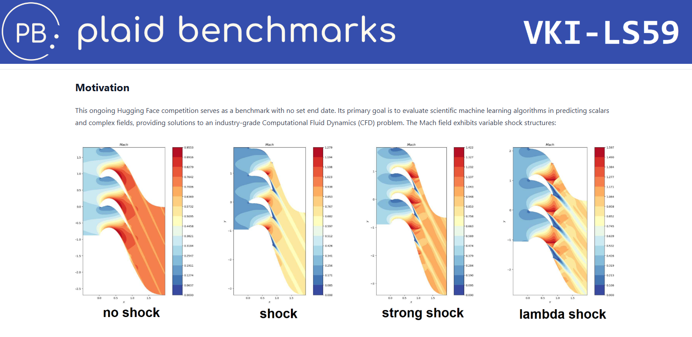
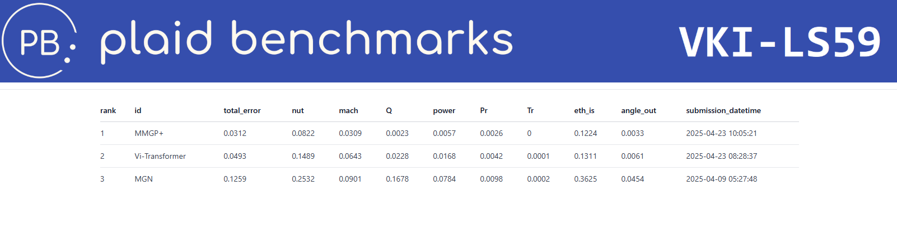
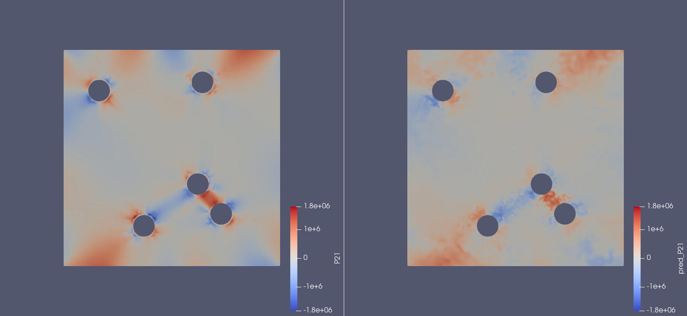
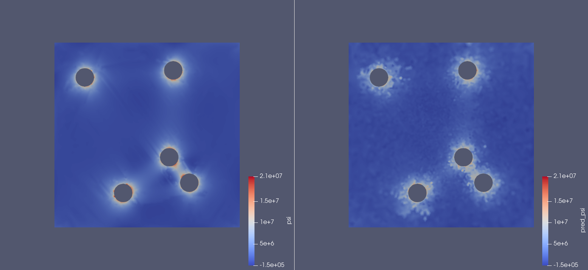
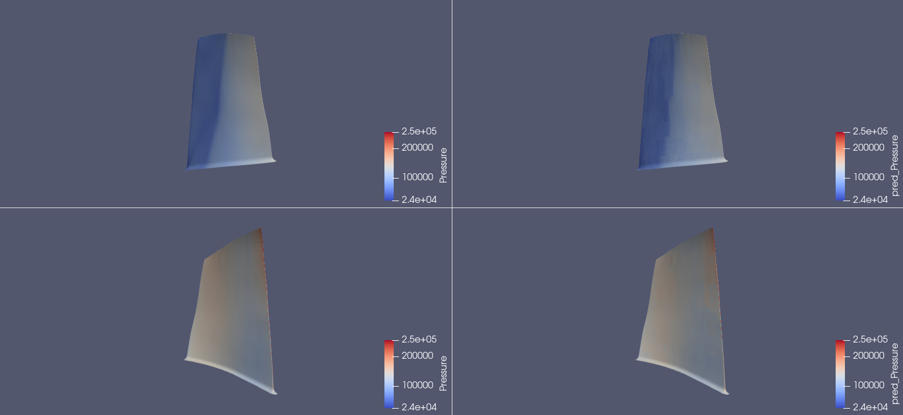
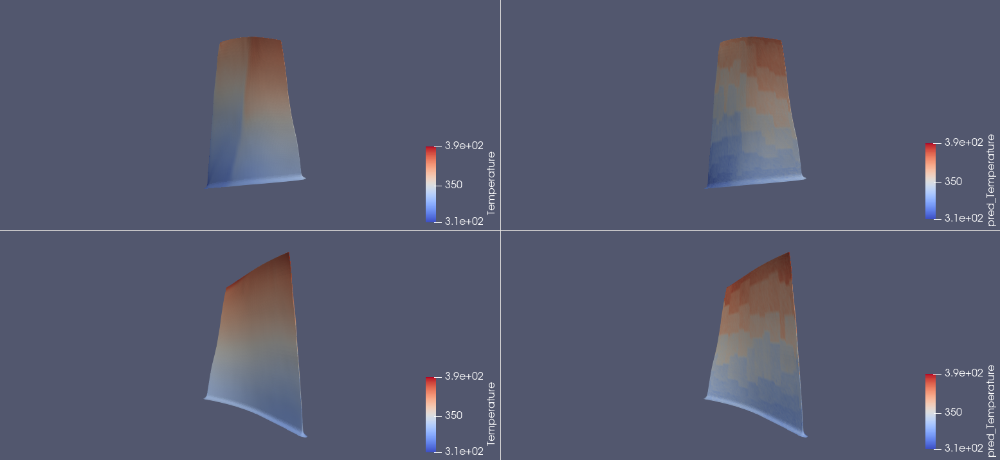

<br></br><br></br><br></br>

# Vi-Transformers for Physical Field Prediction
## Anthony Kalaydjian  
<!-- [Safran Tech](https://www.safran-group.com/fr/groupe/innovation/safran-tech) - [EPFL](https://www.epfl.ch/fr/) -->


<div style="display: flex; justify-content: center; align-items: center; gap: 75px;">
    
    
</div>


<div style="position: absolute; bottom: 1em; right: 1em; font-size: 0.9em; color: #666;">
    25 April 2025
</div>

---

## Physics Mesh Regression Problem


---


<h2 style="display: flex; align-items: center; gap: 10px;">  PLAID Standard</h2>

```
folder
├───dataset
│   ├───samples
│   │   ├───sample_000000000
│   │   │   ├───meshes
│   │   │   │   ├───mesh_000000000.cgns
│   │   │   │   ├───mesh_000000001.cgns
│   │   │   │   ⋮
│   │   │   │   └───mesh_xxxxxxxxx.cgns
│   │   │   └───scalars.csv
│   │   ├───sample_000000001
│   │   ⋮
│   │   └───sample_yyyyyyyyy
│   └───infos.yaml
└───problem_definition
    ├───problem_infos.yaml
    └───split.csv
```

---

## PLAID Benchmark 1/5 -- Datasets

| Dataset                   | Simulation code | Model                                                                         | Nb samples | Volume Zenodo | Volume HF |
|---------------------------|-----------------|-------------------------------------------------------------------------------|------------|---------------|-----------|
| `Tensile2d`               | Z-set           | 2D quasistatic non-linear structural mechanics, small deformations, non-linear constitutive law | 702        | 290 MB        | 1.0 GB    |
| `2D_MultiScHypEl`         | DOLFINx         | 2D quasistatic non-linear structural mechanics, finite elasticity             | 1,140      | 350 MB        | 1.1 GB    |
| `2D_ElPlDynamics`         | OpenRadioss     | 2D dynamic non-linear structural mechanics, non-linear non-local constitutive law | 1,018      | 5.7 GB        | 18 GB     |
| `Rotor37`                 | elsA            | 3D Navier-Stokes (RANS)                                                       | 1,200      | 3.3 GB        | 13 GB     |
| `2D_profile`              | elsA            | 2D Navier-Stokes (RANS)                                                       | 400        | 660 MB        | 2.9 GB    |
| `VKI-LS59`                | BROADCAST       | 2D Navier-Stokes (RANS)                                                       | 839        | 1.9 GB        | 7.4 GB    |
| `AirfRANS original`       | OpenFOAM        | 2D Navier-Stokes (RANS)                                                       | 1,000      | 9.3 GB        | 24 GB     |
| `AirfRANS clipped`        | OpenFOAM        | 2D Navier-Stokes (RANS)                                                       | 1,000      | 9.7 GB        | 26 GB     |
| `AirfRANS remeshed`       | OpenFOAM        | 2D Navier-Stokes (RANS)                                                       | 1,000      | 520 MB        | 2.1 GB    |


---


## PLAID Benchmark 2/5 -- Evaluation Metrics

``
$$
\begin{align*}
\mathrm{RRMSE}_f(\mathbf{f}_{\rm ref}, \mathbf{f}_{\rm pred}) &= \left( \frac{1}{n_\star}\sum_{i=1}^{n_\star} \frac{\frac{1}{N^i}\|\mathbf{f}^i_{\rm ref} - \mathbf{f}^i_{\rm pred}\|_2^2}{\|\mathbf{f}^i_{\rm ref}\|_\infty^2} \right)^{1/2}\\
\mathrm{RRMSE}_s(\mathbf{s}_{\rm ref}, \mathbf{s}_{\rm pred}) &= \left( \frac{1}{n_\star} \sum_{i=1}^{n_\star} \frac{|s^i_{\rm ref} - s_{\rm pred}^i|^2}{|s^i_{\rm ref}|^2} \right)^{1/2}
\end{align*}
$$
$$
\text{score} = \dfrac{1}{N_{\rm sim} \left( N_f + N_s \right)} \left[ \sum_{n=1}^{N_{\rm sim}} \mathrm{RRMSE}_{f}(\mathbf{f}_{\rm ref, n}, \mathbf{f}_{\rm pred, n}) + \mathrm{RRMSE}_{s}(\mathbf{f}_{\rm ref, n}, \mathbf{f}_{\rm pred, n}) \right]
$$
``


---

## PLAID Benchmark 3/5 -- Huggingface Competition

<div style="justify-content: center; align-items: center;">
    
    
</div>

---


## PLAID Benchmark 4/5 -- Problems of Interest


---


## PLAID Benchmark 5/5 -- Problems of Interest


| Dataset                | Mesh (mean nodes) | Inputs         | Outputs            | Splits (train/test)  |
|------------------------|-------------------|----------------|--------------------|----------------------|
| `Tensile2d`            | tri (9,428)       | mesh, 6 scalars| 4 scalars, 6 fields| 500 / 200            |
| `2D_MultiScHypEl`      | tri (5,692)       | mesh, 3 scalars| 1 scalar, 7 fields | 764 / 376            |
| `Rotor37`              | quad (29,773*)    | mesh, 2 scalars| 4 scalars, 3 fields| 1,000 / 200          |
| `2D_profile`           | tri (37,042)      | mesh           | 4 fields           | 300 / 100            |
| `VKI-LS59`             | quad (36,421*)    | mesh, 2 scalars| 6 scalars, 7 fields| 671 / 168            |

---


## Vi-Transformers


---

### Tokenization 1/4 -- Padding

<div style="display: flex; justify-content: center; align-items: center; gap: 20px;">

</div>

---

### Tokenization 2/4 -- 2D Patch Serialization
+ Have a non random ordering of the vertices within a patch
+ Compare patches together


<div style="display: flex; justify-content: center; align-items: center; gap: 20px;">
    
    
</div>

---

### Tokenization 3/4 -- 2D Patch Serialization
#### Morton code

- <span style="color: tomato;"> $x$ : $x_{32}x_{31}...x_1x_0$ </span>
- <span style="color: mediumseagreen;"> $y$ : $y_{32}y_{31}...y_1y_0$ </span>
- morton code : <span style="color: tomato;"><span style="color: mediumseagreen;">$y_{32}$</span>$x_{32}$<span style="color: mediumseagreen;">$y_{31}$</span>$x_{31}$...<span style="color: mediumseagreen;">$y_1$</span>$x_1$<span style="color: mediumseagreen;">$y_0$</span>$x_0$</span>

<pre><code data-trim class="language-python">
    def splitBy2(n: int):
        n = n               & 0x00000000FFFFFFFF
        n = (n | (n << 16)) & 0x0000FFFF0000FFFF
        n = (n | (n << 8))  & 0x00FF00FF00FF00FF
        n = (n | (n << 4))  & 0x0F0F0F0F0F0F0F0F
        n = (n | (n << 2))  & 0x3333333333333333
        n = (n | (n << 1))  & 0x5555555555555555
        return n
</code></pre>

```python
splitBy2(5) #5 = 101
>>> 010001
```

`0.22s` for `10M` integers 

```python
morton = lambda (x, y): splitBy2(x) | splitBy2(y) << 1
```


---

### Tokenization 4/4 -- 3D Patch Serialization
<div style="display: flex; justify-content: center; align-items: center; gap: 20px;">
    <iframe src="assets/morton/3d_grid.html" style="width: 1200px; height: 400px; border: none; font-size: 0.01em;"></iframe>
    <iframe src="assets/morton/3d_pointcloud.html" style="width: 1200px; height: 400px; border: none; font-size: 0.01em;"></iframe>
</div>

---

## Predictions 1/2 -- 2D Multiscale Hyper Elasticity





---

## Predictions 2/2 -- 3D Rotor37






---

## First Benchmark Results

<div style="display: flex; gap: 40px; flex-wrap: wrap; align-items: flex-start;">

  <table border="1">
    <thead>
      <tr>
        <th colspan="3" style="text-align:center; font-size: 1.2em;">2D_profile</th>
      </tr>
      <tr>
        <th>Field</th>
        <th>MGN</th>
        <th>Vi-Transf.</th>
      </tr>
    </thead>
    <tbody>
      <tr>
        <td><strong>Mach</strong></td>
        <td>0.1122</td>
        <td><strong>0.0699</strong></td>
      </tr>
      <tr>
        <td><strong>Pressure</strong></td>
        <td>0.1224</td>
        <td><strong>0.0430</strong></td>
      </tr>
      <tr>
        <td><strong>Velocity-x</strong></td>
        <td>0.1254</td>
        <td><strong>0.0854</strong></td>
      </tr>
      <tr>
        <td><strong>Velocity-y</strong></td>
        <td>0.1176</td>
        <td><strong>0.0570</strong></td>
      </tr>
      <tr>
        <td><strong>total_error</strong></td>
        <td>0.1194</td>
        <td><strong>0.0638</strong></td>
      </tr>
    </tbody>
  </table>

  <table border="1">
    <thead>
      <tr>
        <th colspan="4" style="text-align:center; font-size: 1.2em;">VKI-LS59</th>
      </tr>
      <tr>
        <th>Field</th>
        <th>MGN</th>
        <th>MMGP</th>
        <th>Vi-Transf.</th>
      </tr>
    </thead>
    <tbody>
      <tr>
        <td><strong>nut</strong></td>
        <td>0.2532</td>
        <td><strong>0.0822</strong></td>
        <td><u>0.1489</u></td>
      </tr>
      <tr>
        <td><strong>mach</strong></td>
        <td>0.0901</td>
        <td><strong>0.0309</strong></td>
        <td><u>0.0643</u></td>
      </tr>
      <tr>
        <td><em>Q</em></td>
        <td>0.1678</td>
        <td><strong>0.0023</strong></td>
        <td><u>0.0228</u></td>
      </tr>
      <tr>
        <td><em>power</em></td>
        <td>0.0784</td>
        <td><strong>0.0057</strong></td>
        <td><u>0.0168</u></td>
      </tr>
      <tr>
        <td><em>Pr</em></td>
        <td>0.0098</td>
        <td><strong>0.0026</strong></td>
        <td><u>0.0042</u></td>
      </tr>
      <tr>
        <td><em>Tr</em></td>
        <td>0.0002</td>
        <td><strong>0.0000</strong></td>
        <td><u>0.0001</u></td>
      </tr>
      <tr>
        <td><em>eth_is</em></td>
        <td>0.3625</td>
        <td><strong>0.1224</strong></td>
        <td><u>0.1311</u></td>
      </tr>
      <tr>
        <td><em>angle_out</em></td>
        <td>0.0454</td>
        <td><strong>0.0033</strong></td>
        <td><u>0.0061</u></td>
      </tr>
      <tr>
        <td><strong>total_error</strong></td>
        <td>0.1259</td>
        <td><strong>0.0312</strong></td>
        <td><u>0.0493</u></td>
      </tr>
    </tbody>
  </table>

</div>


---

Below is the HTML code to display the two tables side by side, similar to the format you requested:

<div style="display: flex; gap: 40px; flex-wrap: wrap; align-items: flex-start;">

  <table border="1">
    <thead>
      <tr>
        <th colspan="4" style="text-align:center; font-size: 1.2em;">Tensile2d</th>
      </tr>
      <tr>
        <th>Field</th>
        <th>MMGP</th>
        <th>Vi-Transf.</th>
        <th>Augur</th>
      </tr>
    </thead>
    <tbody>
      <tr>
        <td><strong>U1</strong></td>
        <td><strong>0.0016</strong></td>
        <td>0.0344</td>
        <td><u>0.0093</u></td>
      </tr>
      <tr>
        <td><strong>U2</strong></td>
        <td><strong>0.0013</strong></td>
        <td>0.0424</td>
        <td><u>0.0135</u></td>
      </tr>
      <tr>
        <td><strong>sig11</strong></td>
        <td><strong>0.0037</strong></td>
        <td>0.0715</td>
        <td><u>0.0187</u></td>
      </tr>
      <tr>
        <td><strong>sig22</strong></td>
        <td><strong>0.0015</strong></td>
        <td>0.0341</td>
        <td><u>0.0099</u></td>
      </tr>
      <tr>
        <td><strong>sig12</strong></td>
        <td><strong>0.0026</strong></td>
        <td>0.0494</td>
        <td><u>0.0121</u></td>
      </tr>
      <tr>
        <td><em>max_von_mises</em></td>
        <td><strong>0.0050</strong></td>
        <td><u>0.0145</u></td>
        <td>0.0219</td>
      </tr>
      <tr>
        <td><em>max_U2_top</em></td>
        <td><strong>0.0042</strong></td>
        <td><u>0.0210</u></td>
        <td>0.0344</td>
      </tr>
      <tr>
        <td><em>max_sig22_top</em></td>
        <td><strong>0.0016</strong></td>
        <td><u>0.0022</u></td>
        <td>0.0030</td>
      </tr>
      <tr>
        <td><strong>total_error</strong></td>
        <td><strong>0.0027</strong></td>
        <td>0.0337</td>
        <td><u>0.0154</u></td>
      </tr>
    </tbody>
  </table>

  <table border="1">
    <thead>
      <tr>
        <th colspan="4" style="text-align:center; font-size: 1.2em;">2D_MultiScHypEl</th>
      </tr>
      <tr>
        <th>Field</th>
        <th>MGN</th>
        <th>Vi-Transf.</th>
        <th>Augur</th>
      </tr>
    </thead>
    <tbody>
      <tr>
        <td><strong>u1</strong></td>
        <td>0.1147</td>
        <td><u>0.0350</u></td>
        <td><strong>0.0140</strong></td>
      </tr>
      <tr>
        <td><strong>u2</strong></td>
        <td>0.1274</td>
        <td><u>0.0356</u></td>
        <td><strong>0.0164</strong></td>
      </tr>
      <tr>
        <td><strong>P11</strong></td>
        <td>0.0885</td>
        <td><u>0.0611</u></td>
        <td><strong>0.0185</strong></td>
      </tr>
      <tr>
        <td><strong>P12</strong></td>
        <td>0.1893</td>
        <td><u>0.1016</u></td>
        <td><strong>0.0316</strong></td>
      </tr>
      <tr>
        <td><strong>P22</strong></td>
        <td>0.0891</td>
        <td><u>0.0614</u></td>
        <td><strong>0.0189</strong></td>
      </tr>
      <tr>
        <td><strong>P21</strong></td>
        <td>0.1887</td>
        <td><u>0.1005</u></td>
        <td><strong>0.0311</strong></td>
      </tr>
      <tr>
        <td><strong>psi</strong></td>
        <td>0.0639</td>
        <td><u>0.0580</u></td>
        <td><strong>0.0239</strong></td>
      </tr>
      <tr>
        <td><em>effective_energy</em></td>
        <td>0.0684</td>
        <td><strong>0.0108</strong></td>
        <td><u>0.0313</u></td>
      </tr>
      <tr>
        <td><strong>total_error</strong></td>
        <td>0.1163</td>
        <td><u>0.0580</u></td>
        <td><strong>0.0232</strong></td>
      </tr>
    </tbody>
  </table>

</div>

---

<table border="1">
  <thead>
    <tr>
      <th colspan="5" style="text-align:center; font-size: 1.2em;">Rotor37</th>
    </tr>
    <tr>
      <th>Field</th>
      <th>MGN</th>
      <th>MMGP</th>
      <th>Vi-Transf.</th>
      <th>Augur</th>
    </tr>
  </thead>
  <tbody>
    <tr>
      <td><strong>Density</strong></td>
      <td>0.0364</td>
      <td><strong>0.0039</strong></td>
      <td>0.0370</td>
      <td><u>0.0055</u></td>
    </tr>
    <tr>
      <td><strong>Pressure</strong></td>
      <td>0.0364</td>
      <td><strong>0.0039</strong></td>
      <td>0.0366</td>
      <td><u>0.0053</u></td>
    </tr>
    <tr>
      <td><strong>Temperature</strong></td>
      <td>0.0183</td>
      <td><strong>0.0009</strong></td>
      <td>0.0074</td>
      <td><u>0.0012</u></td>
    </tr>
    <tr>
      <td><em>Massflow</em></td>
      <td>0.0480</td>
      <td><strong>0.0007</strong></td>
      <td>0.0058</td>
      <td><u>0.0028</u></td>
    </tr>
    <tr>
      <td><em>Compression_ratio</em></td>
      <td>0.0490</td>
      <td><strong>0.0007</strong></td>
      <td>0.0055</td>
      <td><u>0.0028</u></td>
    </tr>
    <tr>
      <td><em>Efficiency</em></td>
      <td>0.0124</td>
      <td><strong>0.0009</strong></td>
      <td>0.0067</td>
      <td><u>0.0019</u></td>
    </tr>
    <tr>
      <td><strong>total_error</strong></td>
      <td>0.0334</td>
      <td><strong>0.0019</strong></td>
      <td>0.0165</td>
      <td><u>0.0033</u></td>
    </tr>
  </tbody>
</table>


---

## PLAID Article


---


<br></br><br></br><br></br><br></br>
Thank you for your **attention** !