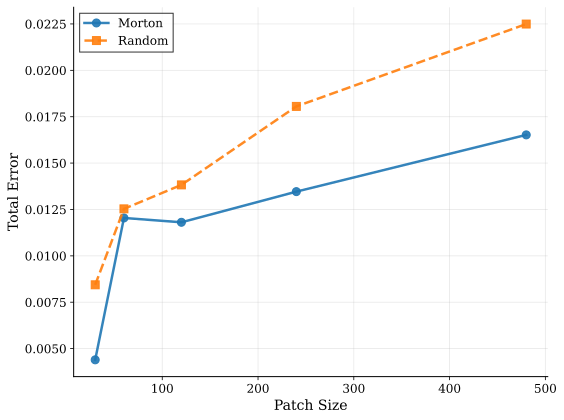

      

<h1 style="margin-bottom: 0.2em; font-size: 2.3em;">Vi-Transformers for Physics Surrogate Modeling</h1>

## Anthony Kalaydjian  
<!-- [Safran Tech](https://www.safran-group.com/fr/groupe/innovation/safran-tech) - [EPFL](https://www.epfl.ch/fr/) -->

    25 August 2025

---

## Physics Mesh Regression Problem

---

## Taxonomy of Models for Variable Domain Geometry

  

    <h3 style="text-align: center;">Shape embedding</h3>
    
SDF embedding

  
  

    
Morphing

  
  

  

    <h3 style="text-align: center;">Relational</h3>
    
GNN

  
  

---

## Transformers

  

---

## Self-Attention

### Simple form

$$
\begin{cases}
    q_n = W_Q x_n\\
    k_n = W_K x_n\\
    v_n = W_V x_n
\end{cases}, \quad
$$
with token $x_n\in \mathbb{R}^l$ and matrices $W_Q, W_K, W_V \in \mathbb{R}^{l \times d}$

$$
    \mathrm{SelfAttention}(q_i, (k_n), (v_n)) = \sum_n \alpha_{i, n} v_n,
$$
where $ \alpha_{i, n} = \dfrac{\exp(q_i^T k_n) / \sqrt{d}}{\sum_n \exp(q_i^T k_n) / \sqrt{d}}$

  

### Matrix form:

$$
\mathrm{SelfAttention}(Q, K, V) = \mathrm{SoftMax}\left(\frac{Q K^T}{\sqrt{d}}\right) V,
$$
where $Q = XW_Q, K = XW_K, V = XW_V$

---

## Transformers in NLP

  

---

## Vision Transformers

  

---

## Transformer for mesh

  

---

## Mesh Vision Transformer

  

---

## Patch flattening 1/4

  

    
    
Morton ordering on a regular 2D grid

  

  

    
    
<code>Tensile2D</code> partitioning

  

---

## Patch flattening 2/4

  

    
    
Patch #0

  

  

    
    
Patch #44

  

---

## Patch flattening 3/4

  

    

      <iframe src="assets/morton/3d_grid.html" style="width: 500px; height: 350px; border: none;"></iframe>
      
Morton ordering on a regular 3D grid

    

    

      <iframe src="assets/morton/rotor37_global_patches_40_60.html" style="width: 500px; height: 350px; border: none;"></iframe>
      
<code>Rotor37</code> partitioning

    

---

## Patch flattening 4/4

  

    

      <iframe src="assets/morton/rotor37_patch_40.html" style="width: 500px; height: 350px; border: none;"></iframe>
      
Patch #40

    

    

      <iframe src="assets/morton/rotor37_patch_60.html" style="width: 500px; height: 350px; border: none;"></iframe>
      
Patch #60

    

  

---

## PLAID Benchmark 1/2

  <strong>PLAID datasets fields visualizations.</strong>

---

## PLAID Benchmark 2/2

| Dataset                | Mesh (mean nodes) | Inputs         | Outputs            | Splits (train/test)  |
|------------------------|-------------------|----------------|--------------------|----------------------|
| `Tensile2d`            | tri (9,428)       | mesh, 6 scalars| 4 scalars, 6 fields| 500 / 200            |
| `2D_MultiScHypEl`      | tri (5,692)       | mesh, 3 scalars| 1 scalar, 7 fields | 764 / 376            |
| `Rotor37`              | quad (29,773*)    | mesh, 2 scalars| 4 scalars, 3 fields| 1,000 / 200          |
| `2D_profile`           | tri (37,042)      | mesh           | 4 fields           | 300 / 100            |
| `VKI-LS59`             | quad (36,421*)    | mesh, 2 scalars| 6 scalars, 7 fields| 671 / 168            |

  <strong>PLAID datasets characteristics.</strong>

### Evaluation metrics

$$
\begin{align*}
\mathrm{RRMSE}_f(\mathbf{f}_{\rm ref}, \mathbf{f}_{\rm pred}) &= \left( \frac{1}{n_\star}\sum_{i=1}^{n_\star} \frac{\frac{1}{N^i}\|\mathbf{f}^i_{\rm ref} - \mathbf{f}^i_{\rm pred}\|_2^2}{\|\mathbf{f}^i_{\rm ref}\|_\infty^2} \right)^{1/2}\\
\mathrm{RRMSE}_s(\mathbf{s}_{\rm ref}, \mathbf{s}_{\rm pred}) &= \left( \frac{1}{n_\star} \sum_{i=1}^{n_\star} \frac{|s^i_{\rm ref} - s_{\rm pred}^i|^2}{|s^i_{\rm ref}|^2} \right)^{1/2}
\end{align*}
$$
$$
\text{total_error} = \dfrac{1}{\left( N_f + N_s \right)} \left[ \sum_{f} \mathrm{RRMSE}_{f}(\mathbf{f}_{\rm ref}, \mathbf{f}_{\rm pred}) + \sum_{s} \mathrm{RRMSE}_{s}(\mathbf{s}_{\rm ref}, \mathbf{s}_{\rm pred}) \right]
$$

---

## Benchmark results 1/2

| Dataset           | MGN    | MVT       | Augur         | MMGP        | MARIO  |
|-------------------|--------|--------   |--------       |--------     |--------|
| `Tensile2d`       | 0.0673 | 0.0116    | 0.0154        | **0.0026**  | <u>0.0038</u> |
| `2D_MultiScHypEl` | 0.0437 | <u>0.0325</u>    | **0.0232**    | -           | 0.0573 |
| `2D_profile`      | 0.0593 | <u>0.0312</u>  | 0.0425   | 0.0365      | **0.0307** |
| `VKI-LS59`        | 0.0684 | <u>0.0193</u>  | 0.0267   | 0.0312      | **0.0124** |
| `Rotor37`         | 0.0074 | 0.0029    | 0.0033        | **0.0014**  | <u>0.0017</u> |

  <strong>Benchmark total errors.

  Best on each line is <b>bold</b>, second best is <u>underlined</u>.</strong>

- **No universal winner**  
- **Shape embedding models (MMGP, MARIO) struggle in varying topology**  
- **MVT >> MGN and consistently strong**

---

## Benchmark results 2/2

  <!-- First row: Tensile2D, Multiscale, 2D Profile -->
  

    

      
      
<code>Tensile2d</code>

    

    

      
      
<code>2D_MultiScHypEl</code>

    

    

      
      
<code>2D_Profile</code>

    

  

  <!-- Second row: Rotor37 and VKIL-S59 -->
  

    

      
      
<code>Rotor37</code>

    

    

      
      
<code>VKIL-S59</code>

    

  

  <strong>MVT predicted fields visualizations.</strong>

---

## Total Error vs Patch Size Comparison

  <!-- First row: 3 figures -->
  

    

      
      
<code>2D_MultiScHypEl</code>

    

    

      
      
<code>2D_profile</code>

    

    

      
      
<code>Tensile2d</code>

    

  

  <!-- Second row: 2 figures -->
  

    

      
      
<code>Rotor37</code>

    

    

      
      
<code>VKI-LS59</code>

    

  

  <strong>Comparison of total error vs patch size for different datasets.</strong>

---

## Questions

- Is positional encoding necessary?
- How about the loss of the grid regularity in images?
- Does the cross-sample partitioning consistency matter?
- Is there enough data in the datasets for the transformer to learn?

---

## Mesh-to-image

  

- 256 x 256 images

---

## RRMSEs for 2D_MultiScHypEl

| Field, _scalar_         | Vit_pe      | Vit_pe_less | U-Net            |  FNO            | MVT (20)       | 
|-------------------------|-------------|-------------|------------------|---------------- |-------------   |
| **u1**                  | 0.0361      | 0.0355      | 0.0291           |  **0.0115**     | <u>0.0213</u>  |
| **u2**                  | 0.0347      | 0.0353      | 0.0283           |  **0.0117**     | <u>0.0210</u>  |
| **P11**                 | 0.0437      | 0.0439      | **0.0349**       | <u>0.0353</u>   | 0.0397         |  
| **P12**                 | 0.0630      | 0.0623      | **0.0498**       |  <u>0.0513</u>  | 0.0718         |
| **P22**                 | 0.0442      | 0.0444      | **0.0347**       |  <u>0.0359</u>  | 0.0405         |  
| **P21**                 | 0.0626      | 0.0617      | **0.0500**       |  <u>0.0510</u>  | 0.0703         |
| **psi**                 | 0.0367      | 0.0365      | <u>0.0350</u>    |  **0.0329**     | 0.0374         |
| _effective_energy_      | 0.0204      | 0.0217      | 0.0180           | <u>0.0120</u>   | **0.0116**     |      
| **total_error**         | 0.0427      | 0.0426      | <u>0.0350</u>    |  **0.0302**     | 0.0392         |

  <strong>Relative Root Mean Square Errors (RRMSEs) for <code>2D_MultiScHypEl</code>.

  Best on each line is <b>bold</b>, second best is <u>underlined</u>.</strong>

---

## MMVT 1/2

  

---

## MMVT 2/2

  

    <table>
      <thead>
        <tr>
          <th>Field, <em>scalar</em></th>
          <th>MMGP</th>
          <th>MVT</th>
          <th>MMVT</th>
        </tr>
      </thead>
      <tbody>
        <tr><td><strong>U1</strong></td><td><strong>0.0015</strong></td><td>0.0086</td><td><u>0.0043</u></td></tr>
        <tr><td><strong>U2</strong></td><td><strong>0.0009</strong></td><td>0.0091</td><td><u>0.0051</u></td></tr>
        <tr><td><strong>sig11</strong></td><td><strong>0.0031</strong></td><td>0.0184</td><td><u>0.0089</u></td></tr>
        <tr><td><strong>sig22</strong></td><td><strong>0.0013</strong></td><td>0.0102</td><td><u>0.0037</u></td></tr>
        <tr><td><strong>sig12</strong></td><td><strong>0.0021</strong></td><td>0.0146</td><td><u>0.0051</u></td></tr>
        <tr><td><em>max_von_mises</em></td><td><strong>0.0050</strong></td><td>0.0090</td><td><u>0.0068</u></td></tr>
        <tr><td><em>max_U2_top</em></td><td><strong>0.0053</strong></td><td>0.0203</td><td><u>0.0073</u></td></tr>
        <tr><td><em>max_sig22_top</em></td><td><strong>0.0017</strong></td><td>0.0021</td><td><u>0.0019</u></td></tr>
        <tr><td><strong>total_error</strong></td><td><strong>0.0026</strong></td><td>0.0116</td><td><u>0.0054</u></td></tr>
      </tbody>
    </table>
    

      <strong>RRMSEs for <code>Tensile2d</code>.</strong>
    

    

      <strong>Best on each line is <b>bold</b>, 2nd best is <u>underlined</u>.</strong>
    

  

  

    
  

---

## Conclusions and future work

- MVT consistently strong results across all benchmarks.
- Much improvement over MGN.
- Regularity improvements (node ordering, morphing).

 

- Patch morphing.
- Improved decoder.

---

        
Thank you for your **attention** !

---

## Appendix
### Morton code

-  $x$ : $x_{32}x_{31}...x_1x_0$ 
-  $y$ : $y_{32}y_{31}...y_1y_0$ 
- morton code : $y_{32}$$x_{32}$$y_{31}$$x_{31}$...$y_1$$x_1$$y_0$$x_0$

`0.44s` for `10M` cells. 

---

## Appendix
### UNET

---

## Appendix
### PLAID Article

  

